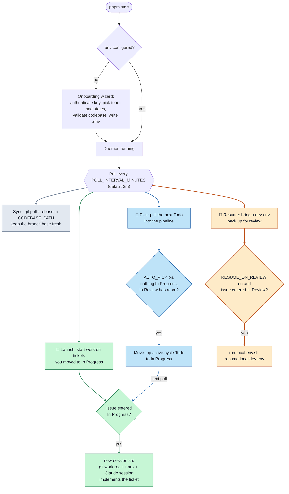

# yimbot

Watches a Linear kanban and launches a local work session (git worktree +
tmux, via `~/new-session.sh`) when an issue assigned to you moves into
In Progress.

Watcher-only Linear daemon. Polls the Linear GraphQL
API — no webhooks, no public endpoint. Issues already In Progress when the
daemon starts are baselined and ignored; only transitions that happen while
it runs launch sessions. Each issue launches at most once per run, and a
failed launch is retried on the next poll.

The daemon also keeps the main codebase fresh: every poll interval it runs
`git pull --rebase origin main` in `CODEBASE_PATH` (default
`~/Work/gemini`), so new worktree sessions branch off up-to-date code. Pull
failures are logged and never crash the daemon.

## How it works

First launch onboards you; then the daemon runs one poll loop every
`POLL_INTERVAL_MINUTES`, driving three independent behaviors off your Linear
board plus a codebase sync.



- 🚀 **Launch (green):** an issue assigned to you entering **In Progress**
  creates a worktree + tmux session and kicks off a Claude session to implement it.
- 🎯 **Pick (blue, `AUTO_PICK`):** when nothing is In Progress and the In-Review
  queue has room (`MAX_REVIEW`), it moves the top-priority active-cycle **Todo**
  into In Progress, which the launch path picks up on the next poll.
- 🔁 **Resume (amber, `RESUME_ON_REVIEW`, off by default):** an issue entering
  **In Review** resumes that worktree's local dev env.

## Setup

```bash
pnpm install
pnpm start   # first run walks you through onboarding, writes .env, then starts
```

On first launch (no `.env`), `pnpm start` drops into an interactive wizard: it
authenticates your Linear API key, lets you pick your team and workflow states
from the real Linear data, validates the codebase path is a git repo, and
checks the helper scripts exist — then writes `.env` and continues into the
daemon. Re-run it anytime with `pnpm onboard` (backs up the old `.env`). You can
still hand-edit `.env` from `.env.example` if you prefer.

## Usage

```bash
pnpm onboard   # (re)configure via the interactive wizard
pnpm check     # one-shot: print the issues the filter currently matches
pnpm start     # run the daemon (Ctrl+C to stop); onboards first if unconfigured
```

## Session launcher

When an issue enters the launch state, the daemon shells out to
`~/new-session.sh <name>`. A generic, self-contained launcher ships in this repo
at [`scripts/new-session.sh`](scripts/new-session.sh): it creates (or reuses) a
git worktree off `CODEBASE_PATH`, opens a tmux session with a Claude window, and
seeds ticket sessions (`eng-…` / `sc-…`) to hand off to the `pickup-ticket`
skill. Install it where the daemon expects it:

```bash
ln -s "$PWD/scripts/new-session.sh" ~/new-session.sh
```

Nothing project-specific is baked in. Point it at your repo and, if you need
per-worktree setup (ports, env files, dependency installs) or a dev-env command,
wire the optional hooks:

```bash
export CODEBASE_PATH=~/Work/your-repo
export SESSION_EDIT_DIRS="frontend backend"      # optional editor windows
export SESSION_SETUP_HOOK=~/my-worktree-setup.sh # optional; called <worktree> <name>
export SESSION_LOCAL_ENV_CMD="docker compose up" # optional; staged in shell history
```
