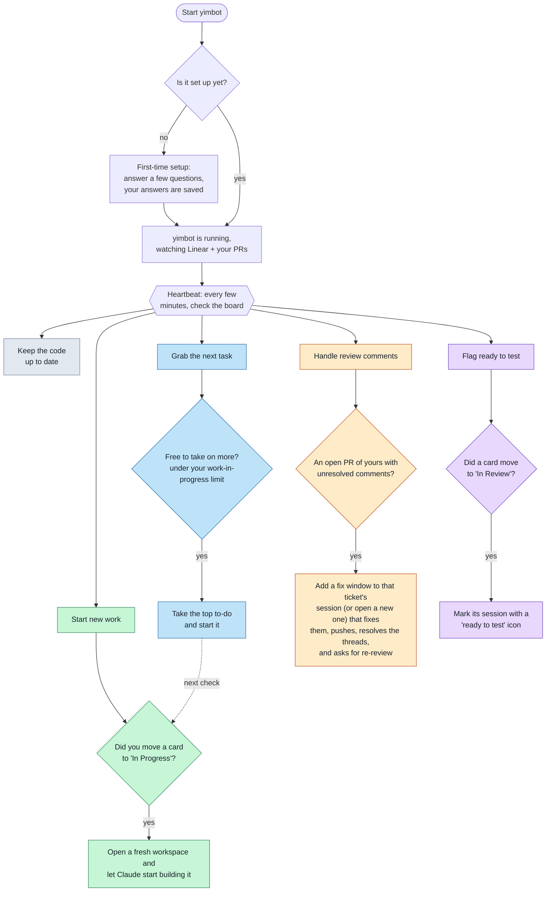

# yimbot

Watches a Linear kanban and launches a local work session (git worktree +
tmux, via `~/new-session.sh`) when an issue assigned to you moves into
In Progress.

Watcher-only Linear daemon. Polls the Linear GraphQL
API — no webhooks, no public endpoint. Issues already In Progress when the
daemon starts are baselined and ignored; only transitions that happen while
it runs launch sessions. Each issue launches at most once per run, and a
failed launch is retried on the next poll.

The daemon also keeps the main codebase fresh: every poll interval it runs
`git pull --rebase origin main` in `CODEBASE_PATH` (default
`~/Work/gemini`), so new worktree sessions branch off up-to-date code. Pull
failures are logged and never crash the daemon.

## How it works

The first time you run it, yimbot asks a few setup questions. After that it
quietly checks your Linear board and your open PRs every few minutes (its
**heartbeat**) and can do four things (plus keep your code up to date):



- **Start new work (green):** when you move a card to **In Progress**, yimbot
  opens a fresh, isolated copy of the code and has Claude start building it.
- **Grab the next task (blue):** while you have fewer than your work-in-progress
  limit of tickets in progress, it pulls your top to-do into progress so the
  deploy step picks it up next time. *(optional; settings: `AUTO_CLAIM`,
  `MAX_IN_PROGRESS` — defaults to 3, set to 1 for one at a time)*
- **Handle review comments (amber):** every heartbeat, for each of your open PRs
  that has unresolved comments, it adds a fix window to that PR's ticket session
  (or opens a standalone session if the ticket session has ended) that addresses
  every comment, gets tests green, pushes, resolves the threads, and re-requests
  review. Needs `gh` installed and authenticated; runs against the repo at
  `CODEBASE_PATH`.
- **Flag ready to test (purple):** when a card moves to **In Review**, it marks
  that card's session with a "ready to test" icon so you know you can run local
  dev there to try it. (yimbot no longer starts the dev env for you.)

## Setup

```bash
pnpm install
pnpm start   # first run walks you through onboarding, writes .env, then starts
```

On first launch (no `.env`), `pnpm start` drops into an interactive wizard: it
authenticates your Linear API key, lets you pick your team and workflow states
from the real Linear data, validates the codebase path is a git repo, links the session launcher and
pickup-ticket skill into place — then writes `.env` and continues into the
daemon. Re-run it anytime with `pnpm onboard` (backs up the old `.env`). You can
still hand-edit `.env` from `.env.example` if you prefer.

## Usage

```bash
pnpm onboard   # (re)configure via the interactive wizard
pnpm check     # one-shot: print the issues the filter currently matches
pnpm start     # run the daemon (Ctrl+C to stop); onboards first if unconfigured
```

## Session launcher & skill

When an issue enters the deploy state, the daemon shells out to
`~/new-session.sh <name>`, which creates (or reuses) a git worktree off
`CODEBASE_PATH`, opens a tmux session with a Claude window, and seeds the session
by name: ticket sessions (`eng-…` / `sc-…`) hand off to the **pickup-ticket**
skill (plan, implement, self-review, finish), and PR fixes (`pr-<n>-fix`,
launched by the review step with `~/new-session.sh pr-<n>-fix <branch>`) hand off
to the **address-pr-comments** skill (fix comments, push, resolve threads,
re-request review). A PR fix is added as a window inside its branch's ticket
session when that session is still alive, so a PR and its ticket share one
session; if the ticket session has ended, it becomes a standalone `pr-<n>-fix`
session instead. All ship in this repo:
[`scripts/new-session.sh`](scripts/new-session.sh),
[`skills/pickup-ticket`](skills/pickup-ticket/SKILL.md), and
[`skills/address-pr-comments`](skills/address-pr-comments/SKILL.md). **`pnpm onboard`
symlinks them into place** (`~/new-session.sh`, `~/.claude/skills/pickup-ticket`,
`~/.claude/skills/address-pr-comments`), verifying them in its pre-flight. An existing
file at either path is never overwritten without asking (it's backed up first).

Nothing project-specific is baked in. Point it at your repo and, if you need
per-worktree setup (ports, env files, dependency installs) or a dev-env command,
wire the optional hooks:

```bash
export CODEBASE_PATH=~/Work/your-repo
export SESSION_EDIT_DIRS="frontend backend"      # optional editor windows
export SESSION_SETUP_HOOK=~/my-worktree-setup.sh # optional; called <worktree> <name>
export SESSION_LOCAL_ENV_CMD="docker compose up" # optional; staged in shell history
export PLAN_MODEL=opus                            # optional; model the session plans on
export IMPL_MODEL=sonnet                          # optional; model for implementation subagents
```

The daemon passes `PLAN_MODEL` / `IMPL_MODEL` through from its `.env` (set them in
`pnpm onboard`): the ticket session plans on `PLAN_MODEL`, and the pickup-ticket
skill runs its implementation subagents on `IMPL_MODEL` — so planning and
implementation can use different models.
