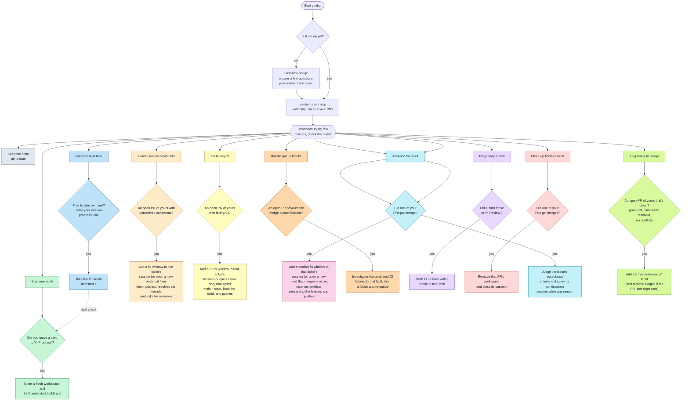

# yimbot

Watches a Linear kanban and launches a local work session (git worktree +
tmux, via `~/new-session.sh`) when an issue assigned to you moves into
In Progress.

Watcher-only Linear daemon. Polls the Linear GraphQL
API — no webhooks, no public endpoint. Issues already In Progress when the
daemon starts are baselined and ignored; only transitions that happen while
it runs launch sessions. Each issue launches at most once per run, and a
failed launch is retried on the next poll.

The daemon also keeps the main codebase fresh: every poll interval it runs
`git pull --rebase origin main` in `CODEBASE_PATH` (default
`~/Work/gemini`), so new worktree sessions branch off up-to-date code. Pull
failures are logged and never crash the daemon.

## How it works

The first time you run it, yimbot asks a few setup questions. After that it
quietly checks your Linear board and your open PRs every few minutes (its
**heartbeat**) and can do several things (plus keep your code up to date):


```mermaid
flowchart TD
    A(["Start yimbot"]) --> B{"Is it set up yet?"}
    B -- no --> W["First-time setup:<br/>answer a few questions,<br/>your answers are saved"]
    W --> C["yimbot is running,<br/>watching Linear + your PRs"]
    B -- yes --> C

    C --> P{{"Heartbeat: every few<br/>minutes, check the board"}}

    P --> S["Keep the code<br/>up to date"]

    P --> G1["Start new work"]
    G1 --> T1{"Did you move a card<br/>to 'In Progress'?"}
    T1 -- yes --> L["Open a fresh workspace and<br/>let Claude start building it"]

    P --> G2["Grab the next task"]
    G2 --> PK{"Free to take on more?<br/>under your work-in-progress limit"}
    PK -- yes --> M["Take the top to-do<br/>and start it"]
    M -.->|next check| T1

    P --> G3["Handle review comments"]
    G3 --> T2{"An open PR of yours with<br/>unresolved comments?"}
    T2 -- yes --> R["Add a fix window to that ticket's<br/>session (or open a new one) that fixes<br/>them, pushes, resolves the threads,<br/>and asks for re-review"]

    P --> G6["Fix failing CI"]
    G6 --> T5{"An open PR of yours<br/>with failing CI?"}
    T5 -- yes --> CI["Add a CI-fix window to that ticket's<br/>session (or open a new one) that syncs<br/>main if stale, fixes the build, and pushes"]

    P --> G7["Fix merge conflicts"]
    G7 --> T6{"An open PR of yours<br/>conflicting with main?"}
    T6 -- yes --> CF["Add a conflict-fix window to that ticket's<br/>session (or open a new one) that merges main in,<br/>resolves conflicts preserving the feature, and pushes"]

    P --> G9["Handle queue blocks"]
    G9 --> T8{"An open PR of yours the<br/>merge queue blocked?"}
    T8 -- yes --> BL["Investigate the combined-CI<br/>failure, fix if at fault, then<br/>unblock and re-queue"]

    P --> G4["Flag ready to test"]
    G4 --> T3{"Did a card move<br/>to 'In Review'?"}
    T3 -- yes --> F["Mark its session with a<br/>'ready to test' icon"]

    P --> G5["Clean up finished work"]
    G5 --> T4{"Did one of your<br/>PRs get merged?"}
    T4 -- yes --> CU["Remove that PR's workspace<br/>and close its session"]

    P --> G7["Advance the work"]
    G7 --> T6{"Did one of your<br/>PRs just merge?"}
    T6 -- yes --> AD["Judge the issue's acceptance<br/>criteria and spawn a continuation<br/>session while any remain"]

    P --> G8["Flag ready to merge"]
    G8 --> T7{"An open PR of yours that's clean?<br/>green CI, comments resolved,<br/>no conflicts"}
    T7 -- yes --> RM["Add the 'ready-to-merge' label<br/>(and remove it again if the<br/>PR later regresses)"]

    classDef deploy fill:#c6f6d5,stroke:#2f855a,color:#1a202c;
    classDef claim fill:#bee3f8,stroke:#2b6cb0,color:#1a202c;
    classDef review fill:#feebc8,stroke:#c05621,color:#1a202c;
    classDef ready fill:#e9d8fd,stroke:#6b46c1,color:#1a202c;
    classDef cleanup fill:#fed7d7,stroke:#c53030,color:#1a202c;
    classDef ci fill:#fefcbf,stroke:#b7791f,color:#1a202c;
    classDef conflict fill:#fbd3e9,stroke:#a61e4d,color:#1a202c;
    classDef sync fill:#e2e8f0,stroke:#718096,color:#1a202c;
    classDef advance fill:#c4f1f9,stroke:#0987a0,color:#1a202c;
    classDef readymerge fill:#d9f99d,stroke:#65a30d,color:#1a202c;
    classDef blocked fill:#fed7aa,stroke:#c2410c,color:#1a202c;
    class G1,T1,L deploy;
    class G2,PK,M claim;
    class G3,T2,R review;
    class G6,T5,CI ci;
    class G7,T6,CF conflict;
    class G9,T8,BL blocked;
    class G4,T3,F ready;
    class G5,T4,CU cleanup;
    class S sync;
    class G7,T6,AD advance;
    class G8,T7,RM readymerge;
```

- **Start new work (green):** when you move a card to **In Progress**, yimbot
  opens a fresh, isolated copy of the code and has Claude start building it.
- **Grab the next task (blue):** while you have fewer than your work-in-progress
  limit of tickets in progress, it pulls your top to-do into progress so the
  deploy step picks it up next time. *(optional; settings: `AUTO_CLAIM`,
  `MAX_IN_PROGRESS` — defaults to 3, set to 1 for one at a time)*
- **Handle review comments (amber):** every heartbeat, for each of your open PRs
  that has unresolved comments, it adds a fix window to that PR's ticket session
  (or opens a standalone session if the ticket session has ended) that addresses
  every comment, gets tests green, pushes, resolves the threads, and re-requests
  review. Needs `gh` installed and authenticated; runs against the repo at
  `CODEBASE_PATH`.
- **Fix failing CI (yellow):** every heartbeat, for each of your open PRs whose
  CI has concluded as failing, it adds a `pr-<n>-ci` fix window to that PR's
  ticket session (or opens a standalone session) that first syncs with `main`
  when the branch is stale (a common cause), otherwise fixes the build, then
  pushes and closes itself. It's a separate session from the comment fix and the
  two never run at once on the same worktree; when both a comment and a CI fix
  are due in the same heartbeat, the comment fix goes first and CI is picked up
  the next tick. Re-triggers only when a push moves the failing commit, so a
  green build never loops. Needs `gh` installed and authenticated.
- **Fix merge conflicts (pink):** every heartbeat, for each of your open PRs that
  is conflicting with main, it adds a `pr-<n>-conflict` fix window to that PR's
  ticket session (or opens a standalone session) that reads the PR to understand
  its intent, merges `main` in (never a rebase, never a force push), resolves the
  conflicts in a way that preserves the PR's feature, verifies, and pushes. If it
  cannot resolve safely without risking the feature, it aborts the merge and
  leaves the PR untouched for a human. It shares the PR's worktree with the
  comment and CI fixes and never runs at the same time as either; within a
  heartbeat the order is comment, then conflict, then CI. Re-triggers only when
  the PR head moves, so a clean bail never loops. Needs `gh` installed and
  authenticated. Any fix session (comment, CI, or conflict) that lingers too
  long is torn down as a backstop, regardless of PR state. *(setting:
  `YIMBOT_FIX_REAP_STALE_MINUTES`, defaults to 90)*
- **Handle queue blocks (orange):** every heartbeat, for each of your open PRs
  the merge queue (Aviator) kicked out after its combined-CI batch failed (it
  carries the `blocked` label), it adds a `pr-<n>-blocked` fix window to that
  PR's ticket session (or a standalone session) that reads Aviator's comment
  for the failed checks and the associated draft PR, investigates the combined
  failure, fixes this PR's code when it is at fault, then unblocks and
  re-queues by removing the `blocked` label and re-adding `ready-to-merge`. If
  it cannot determine or safely fix the cause, it leaves the PR blocked for a
  human. Re-triggers only when the head moves, so a re-block caused by another
  PR in the batch never loops. Settings: `BLOCKED_LABEL` (defaults to
  `blocked`); re-queue reuses `READY_MERGE_LABEL`.
- **Flag ready to test (purple):** when a card moves to **In Review**, it marks
  that card's session with a "ready to test" icon so you know you can run local
  dev there to try it. (yimbot no longer starts the dev env for you.)
- **Clean up finished work (red):** every heartbeat, once one of your PRs is
  merged, yimbot tears down that branch's workspace (its worktree) and closes its
  tmux session via `~/end-session.sh`. *(optional; setting: `AUTO_CLEANUP`, on by
  default)* Needs `gh` installed and authenticated; runs against the repo at
  `CODEBASE_PATH`.
- **Advance the work (teal):** every heartbeat, once one of your PRs is merged,
  yimbot judges its issue against the issue's acceptance criteria and, while any
  remain unmet, spawns a continuation session to keep working the issue.
  *(optional; settings: `AUTO_CONTINUE`, on by default; `MAX_CONTINUATIONS`,
  defaults to 5; `AC_JUDGE_MODEL`, blank uses the claude default)*
- **Flag ready to merge (lime):** every heartbeat, for each of your open
  non-draft PRs that is clean on all three signals (no unresolved review threads,
  no merge conflicts, and CI passing or no CI at all), it adds a `ready-to-merge`
  label so you or an automerge system can see at a glance that it's mergeable. The
  label is removed again only on a hard regression (a new comment, a broken build,
  a conflict), which the fixers then handle; a merely in-flight state (CI still
  running, mergeability not yet computed) holds the label as-is, so a merge queue
  that queues on the label is never yanked back out mid-merge. If your merge queue
  posts its own gating check that only completes once the PR is queued (e.g.
  Aviator's `aviator/checks`), list it in `IGNORE_CHECKS` so it isn't counted as
  perpetually-pending CI and deadlock the label. *(optional; settings:
  `AUTO_READY_LABEL`, on by default; `READY_MERGE_LABEL`, defaults to
  `ready-to-merge` and must already exist in the repo; `IGNORE_CHECKS`, empty by
  default)* Needs `gh` installed and authenticated.

## TUI

Running `pnpm start` from a terminal shows a live ticket board instead of a
scrolling log: one row per ticket, updating in place as the daemon works. A
row's status moves through its lifecycle as work progresses, starting at
**working**, then **addressing review** / **fixing CI** / **resolving
conflict** as those steps kick in, then **ready to test**, then **ready to
merge**, then **merged**. Merged rows stay on the board for a while so you can
see recent completions, then age out. Press `q` to quit the board; it also
stops the daemon. While the board runs it binds `prefix + Y` on the tmux
server, so `prefix + Y` from any session (a ticket session yimbot opened or one
of your own) switches back to the board. The binding is registered when the
board starts and removed when it quits, so nothing needs adding to your
`tmux.conf`. Started outside tmux, the board skips the binding and runs
normally.

When stdout is not a TTY (for example `pnpm start > daemon.log 2>&1 &`), the
board is skipped and yimbot runs headless as before.

The board reads a structured event stream and can be tuned with the env vars
in `.env.example`: `EVENTS_LOG` (the event stream file, default
`events.jsonl`), `EVENTS_LOG_MAX_LINES` (max lines kept before it
self-truncates, default `500`), `TUI_KEEP_MERGED_MS` (how long a merged row
stays before it ages out, in ms, default `300000`), `TUI_MAX_ROWS` (hard cap
on rows shown, default `100`), `TUI_RETURN_KEY` (the tmux prefix-table key that
switches back to the board, default `Y`), and `DAEMON_LOG` (where daemon logs
go when the board owns the terminal, default `daemon.log`).

## Setup

```bash
pnpm install
pnpm start   # first run walks you through onboarding, writes .env, then starts
```

On first launch (no `.env`), `pnpm start` drops into an interactive wizard that
begins with a two-tier prerequisite pre-flight:

- **Required (blocks setup until satisfied):** the tools the daemon and session
  launcher shell out to (`git`, `tmux`, `gh`, `claude`, `node`, `pnpm`), `gh`
  authentication, the `superpowers` plugin (every skill invokes it), and Claude
  Code authentication. The wizard offers to install what it can (detected package
  manager, or `npm`/`corepack` for `claude`/`pnpm`, `gh auth login` for auth) and
  re-checks; the rest show exact instructions and loop until fixed.
- **Recommended (warns, never blocks):** `gh` token `repo`+`workflow` scopes and
  git identity (both offered as one-command fixes), the `linear-server` /
  `shortcut` MCP servers the ticket sessions fetch through, and a tmux
  status line that shows `@feature_status` (the ready-to-test flag).

Then it authenticates your Linear API key, lets you pick your team and workflow
states from the real Linear data, validates the codebase path is a git repo,
links the session launcher and pickup-ticket skill into place, then writes `.env`
and continues into the daemon. Re-run it anytime with `pnpm onboard` (backs up the
old `.env`). You can still hand-edit `.env` from `.env.example` if you prefer.

Spawned sessions launch `claude` with `--dangerously-skip-permissions` so the
pickup / PR-fix flows run unattended (no permission prompt can hang a headless
session). As a safety net that never prompts, the launcher also passes
`--settings` a deny-list (`~/.config/yimbot/session-settings.json`, symlinked by
`pnpm onboard`) that hard-blocks catastrophic commands (force-push, `git clean`,
`rm -rf /` or `~`, `terraform destroy`, `kubectl delete`, `docker` prune/volume
rm, `dropdb`); a denied command fails silently rather than prompting, so it adds
safety without any hang risk. Point `SESSION_SETTINGS` at your own file to extend
it per repo.

## Usage

```bash
pnpm onboard   # (re)configure via the interactive wizard
pnpm check     # one-shot: print the issues the filter currently matches
pnpm start     # run the daemon (Ctrl+C to stop); onboards first if unconfigured
```

## Session launcher & skill

When an issue enters the deploy state, the daemon shells out to
`~/new-session.sh <name>`, which creates (or reuses) a git worktree off
`CODEBASE_PATH`, opens a tmux session with a Claude window, and seeds the session
by name: ticket sessions (`eng-…` / `sc-…`) hand off to the **pickup-ticket**
skill (plan, implement, self-review, finish); PR comment fixes (`pr-<n>-fix`,
launched by the review step with `~/new-session.sh pr-<n>-fix <branch>`) hand off
to the **address-pr-comments** skill (fix comments, push, resolve threads,
re-request review); PR CI fixes (`pr-<n>-ci`, launched the same way) hand off to
the **fix-pr-ci** skill (sync main if stale, otherwise fix the build, push); and
PR conflict fixes (`pr-<n>-conflict`, launched the same way) hand off to the
**fix-pr-conflict** skill (understand the PR, merge main in, resolve conflicts
preserving the feature, push). A PR fix is added as a window inside its branch's
ticket session when that session is still alive, so a PR and its ticket share one
session; if the ticket session has ended, it becomes a standalone `pr-<n>-fix` /
`pr-<n>-ci` / `pr-<n>-conflict` session instead.

Teardown is the mirror: once a PR merges, the cleanup step shells out to
`~/end-session.sh <branch>` (headless), which removes that branch's worktree and
kills its tmux session. Run without an argument it tears down the current tmux
session interactively (moving your client to another session first). All ship in
this repo:
[`scripts/new-session.sh`](scripts/new-session.sh),
[`scripts/end-session.sh`](scripts/end-session.sh),
[`skills/pickup-ticket`](skills/pickup-ticket/SKILL.md),
[`skills/address-pr-comments`](skills/address-pr-comments/SKILL.md),
[`skills/fix-pr-ci`](skills/fix-pr-ci/SKILL.md),
[`skills/fix-pr-conflict`](skills/fix-pr-conflict/SKILL.md), and
[`skills/merge-main`](skills/merge-main/SKILL.md). **`pnpm onboard`
symlinks them into place** (`~/new-session.sh`, `~/end-session.sh`,
`~/.claude/skills/pickup-ticket`, `~/.claude/skills/address-pr-comments`,
`~/.claude/skills/fix-pr-ci`, `~/.claude/skills/fix-pr-conflict`,
`~/.claude/skills/merge-main`), verifying them
in its pre-flight. An existing file
at any path is never overwritten without asking (it's backed up first).

Nothing project-specific is baked in. Point it at your repo and, if you need
per-worktree setup (ports, env files, dependency installs) or a dev-env command,
wire the optional hooks:

```bash
export CODEBASE_PATH=~/Work/your-repo
export SESSION_EDIT_DIRS="frontend backend"      # optional editor windows
export SESSION_SETUP_HOOK=~/my-worktree-setup.sh # optional; called <worktree> <name>
export SESSION_TEARDOWN_HOOK=~/my-teardown.sh    # optional; end-session.sh calls <worktree> <name>
export SESSION_LOCAL_ENV_CMD="docker compose up" # optional; staged in shell history
export PLAN_MODEL=opus                            # optional; model the session plans on
export IMPL_MODEL=sonnet                          # optional; model for implementation subagents
```

The daemon passes `PLAN_MODEL` / `IMPL_MODEL` through from its `.env` (set them in
`pnpm onboard`): the ticket session plans on `PLAN_MODEL`, and the pickup-ticket
skill runs its implementation subagents on `IMPL_MODEL` — so planning and
implementation can use different models.
