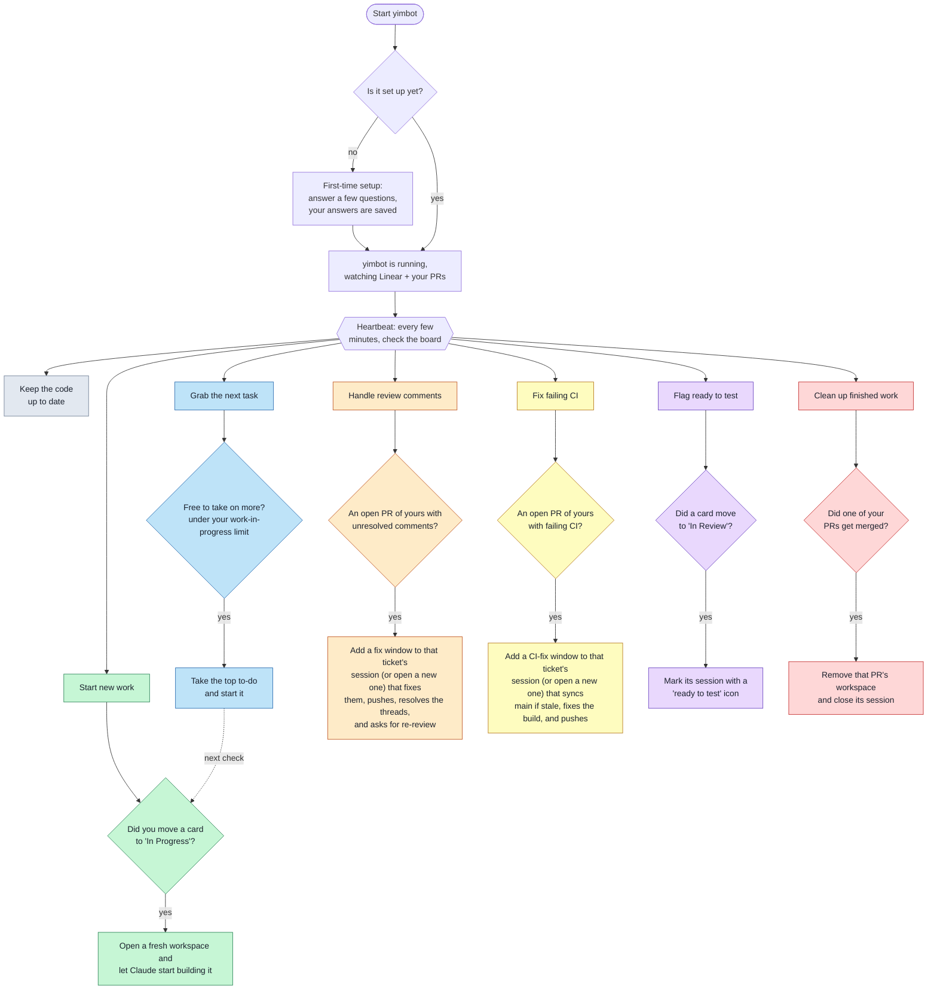

# yimbot

Watches a Linear kanban and launches a local work session (git worktree +
tmux, via `~/new-session.sh`) when an issue assigned to you moves into
In Progress.

Watcher-only Linear daemon. Polls the Linear GraphQL
API — no webhooks, no public endpoint. Issues already In Progress when the
daemon starts are baselined and ignored; only transitions that happen while
it runs launch sessions. Each issue launches at most once per run, and a
failed launch is retried on the next poll.

The daemon also keeps the main codebase fresh: every poll interval it runs
`git pull --rebase origin main` in `CODEBASE_PATH` (default
`~/Work/gemini`), so new worktree sessions branch off up-to-date code. Pull
failures are logged and never crash the daemon.

## How it works

The first time you run it, yimbot asks a few setup questions. After that it
quietly checks your Linear board and your open PRs every few minutes (its
**heartbeat**) and can do six things (plus keep your code up to date):


```mermaid
flowchart TD
    A(["Start yimbot"]) --> B{"Is it set up yet?"}
    B -- no --> W["First-time setup:<br/>answer a few questions,<br/>your answers are saved"]
    W --> C["yimbot is running,<br/>watching Linear + your PRs"]
    B -- yes --> C

    C --> P{{"Heartbeat: every few<br/>minutes, check the board"}}

    P --> S["Keep the code<br/>up to date"]

    P --> G1["Start new work"]
    G1 --> T1{"Did you move a card<br/>to 'In Progress'?"}
    T1 -- yes --> L["Open a fresh workspace and<br/>let Claude start building it"]

    P --> G2["Grab the next task"]
    G2 --> PK{"Free to take on more?<br/>under your work-in-progress limit"}
    PK -- yes --> M["Take the top to-do<br/>and start it"]
    M -.->|next check| T1

    P --> G3["Handle review comments"]
    G3 --> T2{"An open PR of yours with<br/>unresolved comments?"}
    T2 -- yes --> R["Add a fix window to that ticket's<br/>session (or open a new one) that fixes<br/>them, pushes, resolves the threads,<br/>and asks for re-review"]

    P --> G6["Fix failing CI"]
    G6 --> T5{"An open PR of yours<br/>with failing CI?"}
    T5 -- yes --> CI["Add a CI-fix window to that ticket's<br/>session (or open a new one) that syncs<br/>main if stale, fixes the build, and pushes"]

    P --> G4["Flag ready to test"]
    G4 --> T3{"Did a card move<br/>to 'In Review'?"}
    T3 -- yes --> F["Mark its session with a<br/>'ready to test' icon"]

    P --> G5["Clean up finished work"]
    G5 --> T4{"Did one of your<br/>PRs get merged?"}
    T4 -- yes --> CU["Remove that PR's workspace<br/>and close its session"]

    classDef deploy fill:#c6f6d5,stroke:#2f855a,color:#1a202c;
    classDef claim fill:#bee3f8,stroke:#2b6cb0,color:#1a202c;
    classDef review fill:#feebc8,stroke:#c05621,color:#1a202c;
    classDef ready fill:#e9d8fd,stroke:#6b46c1,color:#1a202c;
    classDef cleanup fill:#fed7d7,stroke:#c53030,color:#1a202c;
    classDef ci fill:#fefcbf,stroke:#b7791f,color:#1a202c;
    classDef sync fill:#e2e8f0,stroke:#718096,color:#1a202c;
    class G1,T1,L deploy;
    class G2,PK,M claim;
    class G3,T2,R review;
    class G6,T5,CI ci;
    class G4,T3,F ready;
    class G5,T4,CU cleanup;
    class S sync;
```

- **Start new work (green):** when you move a card to **In Progress**, yimbot
  opens a fresh, isolated copy of the code and has Claude start building it.
- **Grab the next task (blue):** while you have fewer than your work-in-progress
  limit of tickets in progress, it pulls your top to-do into progress so the
  deploy step picks it up next time. *(optional; settings: `AUTO_CLAIM`,
  `MAX_IN_PROGRESS` — defaults to 3, set to 1 for one at a time)*
- **Handle review comments (amber):** every heartbeat, for each of your open PRs
  that has unresolved comments, it adds a fix window to that PR's ticket session
  (or opens a standalone session if the ticket session has ended) that addresses
  every comment, gets tests green, pushes, resolves the threads, and re-requests
  review. Needs `gh` installed and authenticated; runs against the repo at
  `CODEBASE_PATH`.
- **Fix failing CI (yellow):** every heartbeat, for each of your open PRs whose
  CI has concluded as failing, it adds a `pr-<n>-ci` fix window to that PR's
  ticket session (or opens a standalone session) that first syncs with `main`
  when the branch is stale (a common cause), otherwise fixes the build, then
  pushes and closes itself. It's a separate session from the comment fix and the
  two never run at once on the same worktree; when both a comment and a CI fix
  are due in the same heartbeat, the comment fix goes first and CI is picked up
  the next tick. Re-triggers only when a push moves the failing commit, so a
  green build never loops. Needs `gh` installed and authenticated.
- **Flag ready to test (purple):** when a card moves to **In Review**, it marks
  that card's session with a "ready to test" icon so you know you can run local
  dev there to try it. (yimbot no longer starts the dev env for you.)
- **Clean up finished work (red):** every heartbeat, once one of your PRs is
  merged, yimbot tears down that branch's workspace (its worktree) and closes its
  tmux session via `~/end-session.sh`. *(optional; setting: `AUTO_CLEANUP`, on by
  default)* Needs `gh` installed and authenticated; runs against the repo at
  `CODEBASE_PATH`.

## Setup

```bash
pnpm install
pnpm start   # first run walks you through onboarding, writes .env, then starts
```

On first launch (no `.env`), `pnpm start` drops into an interactive wizard. It
first runs a prerequisite pre-flight that verifies the tools the daemon and
session launcher shell out to (`git`, `tmux`, `gh`, `claude`, `node`, `pnpm`) and
that `gh` is authenticated; anything missing blocks setup, and the wizard offers
to install it for you (via the detected package manager, or `npm`/`corepack` for
`claude`/`pnpm`, or `gh auth login` for authentication) before re-checking. Then
it authenticates your Linear API key, lets you pick your team and workflow states
from the real Linear data, validates the codebase path is a git repo, links the
session launcher and pickup-ticket skill into place, then writes `.env` and
continues into the daemon. Re-run it anytime with `pnpm onboard` (backs up the
old `.env`). You can still hand-edit `.env` from `.env.example` if you prefer.

## Usage

```bash
pnpm onboard   # (re)configure via the interactive wizard
pnpm check     # one-shot: print the issues the filter currently matches
pnpm start     # run the daemon (Ctrl+C to stop); onboards first if unconfigured
```

## Session launcher & skill

When an issue enters the deploy state, the daemon shells out to
`~/new-session.sh <name>`, which creates (or reuses) a git worktree off
`CODEBASE_PATH`, opens a tmux session with a Claude window, and seeds the session
by name: ticket sessions (`eng-…` / `sc-…`) hand off to the **pickup-ticket**
skill (plan, implement, self-review, finish); PR comment fixes (`pr-<n>-fix`,
launched by the review step with `~/new-session.sh pr-<n>-fix <branch>`) hand off
to the **address-pr-comments** skill (fix comments, push, resolve threads,
re-request review); and PR CI fixes (`pr-<n>-ci`, launched the same way) hand off
to the **fix-pr-ci** skill (sync main if stale, otherwise fix the build, push). A
PR fix is added as a window inside its branch's ticket session when that session
is still alive, so a PR and its ticket share one session; if the ticket session
has ended, it becomes a standalone `pr-<n>-fix` / `pr-<n>-ci` session instead.

Teardown is the mirror: once a PR merges, the cleanup step shells out to
`~/end-session.sh <branch>` (headless), which removes that branch's worktree and
kills its tmux session. Run without an argument it tears down the current tmux
session interactively (moving your client to another session first). All ship in
this repo:
[`scripts/new-session.sh`](scripts/new-session.sh),
[`scripts/end-session.sh`](scripts/end-session.sh),
[`skills/pickup-ticket`](skills/pickup-ticket/SKILL.md),
[`skills/address-pr-comments`](skills/address-pr-comments/SKILL.md), and
[`skills/fix-pr-ci`](skills/fix-pr-ci/SKILL.md). **`pnpm onboard`
symlinks them into place** (`~/new-session.sh`, `~/end-session.sh`,
`~/.claude/skills/pickup-ticket`, `~/.claude/skills/address-pr-comments`,
`~/.claude/skills/fix-pr-ci`), verifying them in its pre-flight. An existing file
at any path is never overwritten without asking (it's backed up first).

Nothing project-specific is baked in. Point it at your repo and, if you need
per-worktree setup (ports, env files, dependency installs) or a dev-env command,
wire the optional hooks:

```bash
export CODEBASE_PATH=~/Work/your-repo
export SESSION_EDIT_DIRS="frontend backend"      # optional editor windows
export SESSION_SETUP_HOOK=~/my-worktree-setup.sh # optional; called <worktree> <name>
export SESSION_TEARDOWN_HOOK=~/my-teardown.sh    # optional; end-session.sh calls <worktree> <name>
export SESSION_LOCAL_ENV_CMD="docker compose up" # optional; staged in shell history
export PLAN_MODEL=opus                            # optional; model the session plans on
export IMPL_MODEL=sonnet                          # optional; model for implementation subagents
```

The daemon passes `PLAN_MODEL` / `IMPL_MODEL` through from its `.env` (set them in
`pnpm onboard`): the ticket session plans on `PLAN_MODEL`, and the pickup-ticket
skill runs its implementation subagents on `IMPL_MODEL` — so planning and
implementation can use different models.
